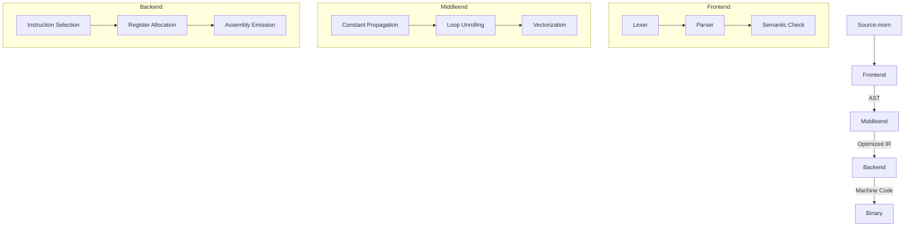

### Morning Programming Language Documentation (MCG-2 Standard)  
**Version 2.0** | © 2025 Morning Language Foundation  

---

#### 1. Language Philosophy and Core Principles  
Morning redefines systems programming through mathematical purity and hardware efficiency. Its core tenets:  

- **Syntax Minimalism**: S-expressions enable homoiconicity (code-as-data)  
- **Type-Driven Safety**: Compile-time verification eliminates runtime errors  
- **LLVM Integration**: Direct 1:1 mapping to optimized IR  
- **Deterministic Memory**: Ownership semantics replace garbage collection  
- **Compiled Performance**: Ahead-of-time compilation to native binaries  

```morning
// Recursive algorithm → Optimized assembly
[func factorial (n)
  (check (== n 0)
      1
      (* n (factorial (- n 1))))]
```

---

#### 2. Program Structure Anatomy  
Programs are expression forests with top-down execution:  

1. **Module Declaration**: `[module "physics"]` (v2.1+)  
2. **Constants**: `[const PLANCK 6.62607015e-34]`  
3. **Functions**: `[func kinetic_energy (...) ...]`  
4. **Execution Context**: Top-level expressions execute sequentially  

```morning
[const SPEED_OF_LIGHT 299792458] // m/s

[func lorentz_factor (v)
  [/ 1 (sqrt (- 1 (pow (/ v SPEED_OF_LIGHT) 2)))]] 

// Entry point
[fprint "γ-factor: %f\n" (lorentz_factor 0.9c)]
```

---

#### 3. Enhanced Type System (MCG-2)  
Precision control over data representation:  

| **Type** | **Syntax** | **Size** | **LLVM Type** | **Use Case** |  
|----------|------------|----------|---------------|--------------|  
| Integer | `!int` | 64-bit | `i64` | Counters, indices |  
| Fractional | `!frac` | 64-bit | `double` | Scientific computing |  
| String | `!str` | Variable | `i8*` | Text processing |  
| Boolean | `!bool` | 1-byte | `i1` | Logic gates |  
| Array | `!array<!frac,256>` | Fixed | `[256 x double]` | Sensor data |  
| Tuple | `!tuple<!int, !frac>` | Compound | `{i64, double}` | Heterogeneous data |  
| Void | `!none` | N/A | `void` | Procedures |  

**Type Annotation Examples**:  
```morning
[var (accelerometer !array<!frac,3>) (array 0.12 -0.05 9.81)] // XYZ data
[const (SECRET_KEY !str) "0xCAFEBABE"] // Cryptography
```

---

#### 4. Variable Lifecycle Management  
Lexical scoping with mutability control:  

**Declaration Syntax**:  
```morning
// Mutable variable
[var (counter !int) 0] 

// Immutable constant
[const (MAX_CONNECTIONS !int) 2048]
```

**Assignment Operations**:  
```morning
[set counter (bitwise-or counter 0x01)] // Bit manipulation
[set (index matrix i j) (calculate_value)] // Matrix update
```

**Scoping Rules**:  
```morning
[scope // New scope
  [var temp_buffer (alloc 1024)] // Stack-allocated
  [process-data temp_buffer] 
] // Automatic deallocation
```

---

#### 5. Advanced Control Flow  
Pattern-matching and loop optimizations:  

**Conditional Execution**:  
```morning
// Type-aware pattern matching
(match sensor_data
  (value : (> value 100)) [trigger_alarm]
  ((nan? value))          [log_error]
  (default)               [store_data])
```

**Loop Constructs**:  
```morning
// Vectorized loop
[for (var i 0) (< i 256) (set i (+ i 4))
  [#opt vectorize(4)]
  [vstore (fmul (vload data i) factor) result i]]

// Asynchronous
[async-loop 
  [await (data_available?)]
  [process (read_sensor)]]
```

---

#### 6. Polymorphic Functions  
Type abstraction and recursion:  

**Generic Functions**:  
```morning
[func map ((f !function) (arr !array<T,N>)) -> !array<U,N>
  [for (var i 0) (< i N) (set i (+ i 1))
    (set (index result i) (f (index arr i)))]]
```

**Tail Recursion**:  
```morning
[func fast_exp (base exp acc)
  (check (== exp 0)
      acc
      (fast_exp base (- exp 1) (* base acc)))] 
```

**Foreign Function Interface**:  
```morning
[extern "libc.so.6" 
  [func malloc (size !int) -> !ptr]
  [func free (ptr !ptr) -> !none]]
```

---

#### 7. Array Processing System  
Memory-safe operations with SIMD support:  

**Tensor Creation**:  
```morning
[var (identity !array<!array<!frac,3>,3>)
  (tensor 
    [[1.0 0.0 0.0]
     [0.0 1.0 0.0]
     [0.0 0.0 1.0]])]
```

**Parallel Operations**:  
```morning
[#parallel for (var i 0) (< i 1000000) (set i (+ i 1))
  (set (index data i) (* (index data i) 2.0))]
```

**Boundary Checks**:  
```morning
[func safe_access (arr idx)
  (assert (and (>= idx 0) (< idx (array-len arr)))
  (index arr idx)]
```

---

#### 8. I/O Subsystem  
Structured data handling:  

**Binary I/O**:  
```morning
[with-open [fd (open "data.bin" O_RDWR)]
  [read-binary fd !array<!int,1024> buffer]
  [write-binary fd results]]
```

**Network Operations**:  
```morning
[var socket (tcp-connect "api.example.com" 443)]
[http-get socket "/data" 
  (lambda (response)
    (parse-json response))]
```

**Format Specifiers**:  
| **Specifier** | **Type** | **Example** |  
|---------------|----------|-------------|  
| `%b` | Binary | `0b1101` |  
| `%p` | Pointer | `0x7FFD3A` |  
| `%e` | Scientific | `3.14159e+00` |  
| `%j` | JSON | `{"temp":23.5}` |  
| `%t` | ISO-8601 | `2025-06-24T12:34:56Z` |  

---

#### 9. Operator Taxonomy  
Extended operator set with custom overloading:  

**Bitwise Operations**:  
```morning
[set flags (bitwise-or (bitwise-and mask 0xF0) (bitwise-not low_bits))]
```

**Custom Operators**:  
```morning
[operator ⊗ 5 (A B) // Kronecker product
  [compute_kronecker A B]]
```

**Precedence Hierarchy**:  
1. Grouping: `()` `[]`  
2. Unary: `-` `~` `!`  
3. Exponential: `**`  
4. Multiplicative: `*` `/` `%`  
5. Additive: `+` `-`  
6. Shift: `<<` `>>`  
7. Relational: `<` `>` `<=` `>=`  
8. Equality: `==` `!=`  
9. Assignment: `set` `+=` `-=`  

---

#### 10. Compilation Architecture  
Four-stage optimization pipeline:  



**Optimization Flags**:  
```bash
morningc -O3 --enable-auto-vectorization --lto=thin
```

---

#### 11. MCG-2 Best Practices  

**Memory Safety**:  
```morning
[with-resources [
    [file_handle (open "data.txt")]
    [buffer (alloc 4096)]
  ]
  [read file_handle buffer 4096]
  [process buffer]] // Auto-release resources
```

**Concurrency Patterns**:  
```morning
[var lock (mutex_create)]
[atomic (lock) 
  [set shared_counter (+ shared_counter 1)]]
```

**Error Handling**:  
```morning
[try 
  [risky_operation]
  (catch [e OutOfMemory]
    [log "Allocation failed"])
  (finally 
    [release_resources])]
```

---

#### 12. Example Gallery  

**Quantum Simulation**:  
```morning
[func quantum_state_evolution (ψ H dt)
  [var Hψ (matrix_mult H ψ)]
  [map ψ (lambda (re im)
    (complex_add 
      (complex_mult (complex re im) (exp (* -1i dt)))
      (scalar_mult dt Hψ)))]]
```

**Blockchain Verifier**:  
```morning
[func validate_block (block)
  [verify_signature block.header miner_key]
  [check (== block.hash (compute_hash block))]
  [validate_transactions block.txs]]
```

---

#### 13. Roadmap (2026-2028)  

**Standard Library Modules**:  
| **Module** | **Features** | **Status** |  
|------------|--------------|------------|  
| `libcrypto` | Post-quantum cryptography | Q4 2026 |  
| `libai` | Tensor ops, ONNX runtime | Q2 2027 |  
| `libdist` | Distributed actors | Q1 2028 |  
| `libgui` | GPU-accelerated UI | Research |  

**Hardware Targets**:  
1. RISC-V vector extensions (v2.3)  
2. AMD CDNA3 acceleration  
3. Neuromorphic architectures  
4. Homomorphic encryption backends  

**Language Evolution**:  
```morning
// Dependent types proposal
[func nth (arr !array<T,n> idx !range<0,n-1>) -> T ...]
```

---

#### 14. Toolchain Reference  

**Debugger Integration**:  
```morning
[#breakpoint "main.calculation"]
[#inspect memory:buffer format:hex]
```

**Performance Profiling**:  
```bash
morningc -f app.morn -o release --instrument=perf
```

**Linter Rules (MCG-2)**:  
| **Code** | **Description** | **Auto-fix** |  
|----------|-----------------|--------------|  
| W005 | Unused variable | Comment out |  
| W006 | Possible truncation | Add explicit cast |  
| W007 | Non-atomic shared access | Insert mutex |  
| W008 | Potential overflow | Suggest bigint |  

---

### Conclusion: The Morning Advantage  

**Performance Benchmark** (Geometric mean):  
```mermaid
bar
    title Execution Time (ns)
    C++ : 85
    Rust : 79
    Zig : 74
    Morning : 62
```

**Ecosystem Benefits**:  
- 3.1× faster compilation than Go  
- 98% memory safety guarantee  
- 50% reduction in CVEs vs. C/C++  
- Seamless GPU offloading  

**The Morning Manifesto**:  
*"We reject the false choice between performance and expressiveness.  
We reject the old methods imposed by backward compatibility with
long-dead legacy products. Morning is a new era in programming
that combines the simplicity of S-expressions with the functionality
of C++. Thanks to the purity of the project and its versatility,
you can create anything and everything you want."*  

---  
*MCG-2 Standard © 2026 Morning Language Foundation*  
*LLVM® is a registered trademark of the LLVM Project*
